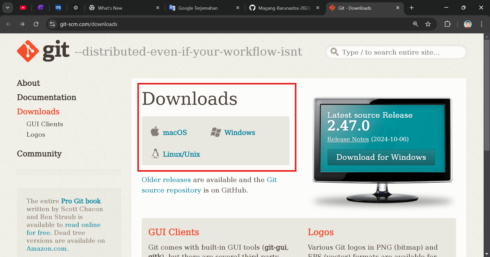
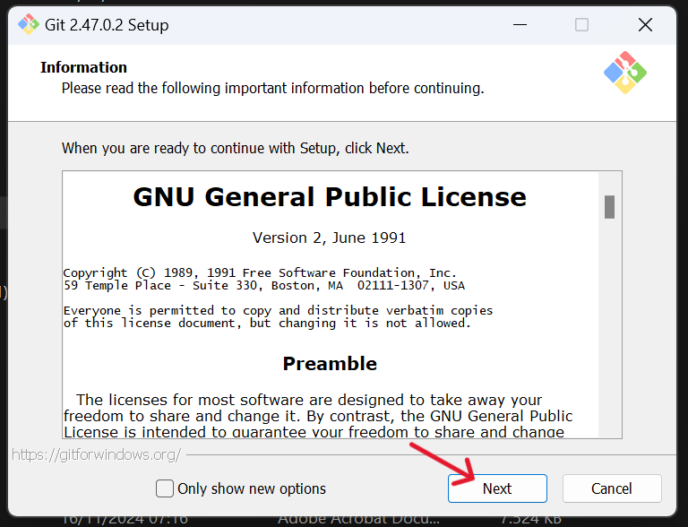
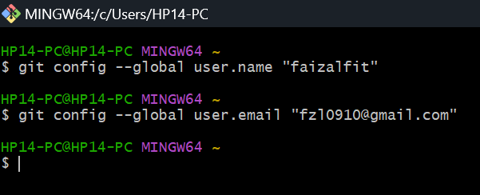
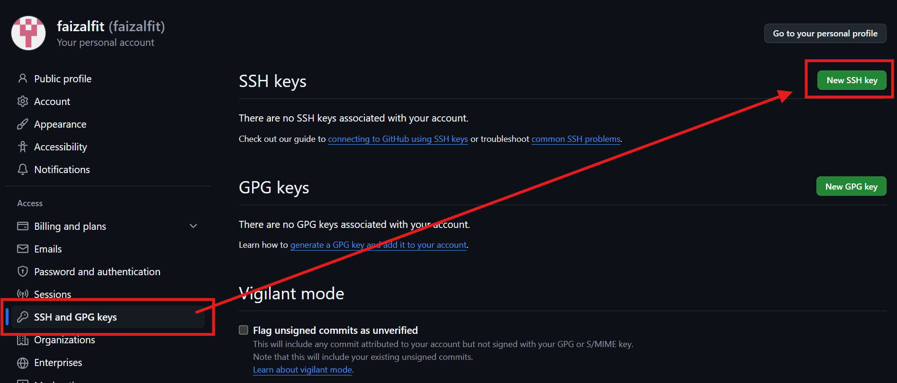
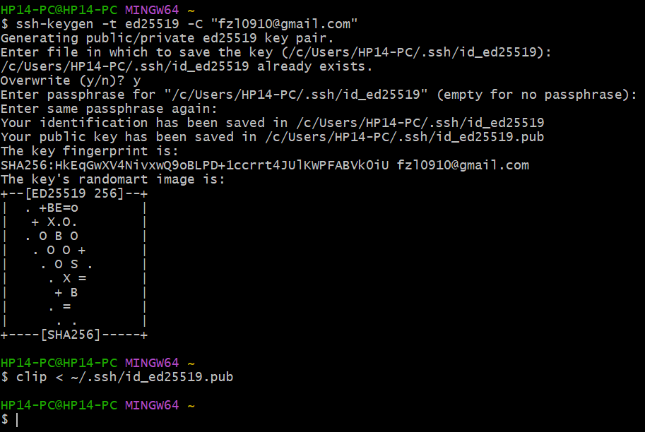

[](https://classroom.github.com/a/tbEHDGEc)

# Git and Github Introduction

| Nama  | Division        | Sub-Division  |
| ----- | ---------- | ---------- |
| Faizal Fitrohni   | ELC | Microcontroller |

## Early Procedure
### 1. Install Git
- Unduh Git melalui tautan berikut: https://git-scm.com/downloads.



- Ikuti instruksi instalasi sesuai sistem operasi Anda (Windows, macOS, atau Linux).



### 2. Buat Akun GitHub
- Daftar di https://github.com/join dengan mengisi informasi yang diperlukan.

### 3. Konfigurasi Git
- Buka Git Bash atau terminal dan masukkan perintah berikut:
```bash
git config --global user.name "(NamaPengguna)"
```
```bash
git config --global user.email "(EmailAnda)"
```

- Pastikan Anda mengganti (NamaPengguna) dan (EmailAnda) dengan informasi sesuai akun GitHub Anda.

### 4. Membuat SSH Key

- Langkah ini memungkinkan GitHub mengenali perangkat Anda tanpa perlu memasukkan kredensial setiap saat.

- Langkah-langkah: 

a. Di GitHub, buka Settings > SSH and GPG Keys > New SSH Key. 



b. Buat SSH Key dengan menjalankan perintah berikut di Git Bash:
```bash
ssh-keygen -t ed25519 -C "(EmailAnda)"
```



Tekan Enter untuk setiap prompt (biarkan default).

c. Salin SSH Key Anda dengan perintah:

```bash
clip < ~/.ssh/id_ed25519.pub
```

d. Kembali ke GitHub, tempelkan key yang disalin ke kolom Key pada halaman New SSH Key.

## Create Repository

#### 1. Buat Repository di Github
- Masuk ke : 
```bash
https://github.com/new
```
- Isi nama repository, pilih tipe (public/private), lalu klik Create Repository.

#### 2. Hubungkan Repository dengan File Lokal

- Setelah repository dibuat, salin tautan SSH dari repository dengan cara
Klik tombol <b><i>Code > SSH > Salin URL</i></b>.

Anda dapat menghubungkan repository dengan dua cara:

a. Manual

- Buat folder baru di komputer Anda dengan nama yang sama seperti repository.
- Buka folder tersebut, klik kanan, lalu pilih Git Bash Here.
- Jalankan perintah berikut di Git Bash:
```bash
git init
```
```bash
git remote add origin [tautan-SSH]
```
```bash
git branch -M main
```
```bash
git pull origin main
```
- Pastikan mengganti [tautan-SSH] dengan tautan SSH yang telah disalin.

b. Menggunakan Git Clone

- Buka Git Bash di lokasi folder induk Anda.

- Jalankan perintah berikut:

```bash
git clone [tautan-SSH]
```
- Folder repository akan otomatis dibuat. Masuk ke folder tersebut, klik kanan, lalu buka Git Bash untuk melanjutkan.

## Push File from Local to Github
### 1. Tambahkan file yang diinginkan ke folder repository lokal.
### 2. Buka Git Bash di dalam folder tersebut.
### 3. Jalankan perintah berikut secara berurutan:
```bash
git add .
```
```bash
git commit -m "Deskripsi singkat perubahan"
```
```bash
git push origin main
```

## Create New Branch in Github
Branch digunakan untuk membuat versi lain dari repository tanpa mengubah branch utama.

1. Buat branch baru dengan perintah:
```bash
git checkout -B [nama-branch]
```
2. Untuk berpindah ke branch tersebut:
```bash
git checkout [nama-branch]
```

## Delete Branch in Github
1. Pastikan Anda berada di branch lain sebelum menghapus branch yang diinginkan:
```bash
git checkout [branch-lain]
```
2. Hapus branch dengan perintah:
```bash
git branch -d [nama-branch]
```

## Merging Branch in Github
1. Beralih ke branch utama yang akan menerima perubahan
```bash
git checkout [branch-utama]
```
2. Gabungkan branch dengan perintah:
```bash
git merge [branch-yang-digabungkan]
```

## View Status and Log
### 1. Melihat Status Perubahan
- Gunakan perintah berikut untuk melihat status file di repository lokal:
```bash
git status
```
- Output akan menampilkan file yang telah diubah, ditambahkan, atau belum dilacak.

### 2. Melihat Riwayat Commit
- Gunakan perintah ini untuk melihat daftar commit sebelumnya:
```bash
git log
```
- Untuk tampilan lebih ringkas:
```bash
git log --oneline
```

## Cancel Changes
### 1. Membatalkan Perubahan di File Sebelum Commit
- Jika ada file yang telah dimodifikasi tetapi ingin mengembalikannya ke versi terakhir:
```bash
git checkout -- [nama-file]
```

### 2. Menghapus File dari Staging Area
- Jika sudah menjalankan <i><b>git add</b></i> tetapi ingin membatalkan proses itu:
```bash
git reset [nama-file]
```

### 3. Membatalkan Commit Terakhir
- Jika commit terakhir salah dan ingin memperbaikinya:
```bash
git reset --soft HEAD~1
```
- <i><b>Catatan</b></i>: Ini hanya menghapus commit, tetapi perubahan tetap ada di staging area.
## Tips
- Pastikan untuk selalu menarik (pull) perubahan terbaru sebelum memulai pekerjaan di repository lokal:
```bash
git pull origin main
```
```bash
Gunakan pesan commit yang jelas dan deskriptif agar mudah melacak perubahan di masa mendatang.
```